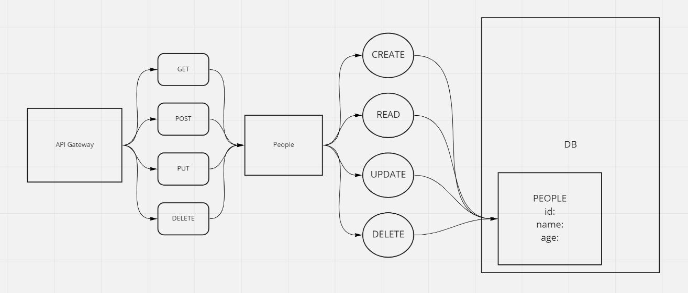

# serverless-api

Create a serverless REST API

## UML 

## Documentation

Document the data and program flow for your API, including the mapping of Routes and Functions, as well as the flow of data.

What is the root URL to your API?

## Feature Tasks & Requirements

What are the routes?
What inputs do they require?
What output do they return?

**POST**

`/people` Given a JSON body, inserts a record into the database returns an object representing one record, by its id (##)

**GET**

`/people` Returns an array of objects representing the records in the database

`/people/##` Returns an object representing one record, by its id (##)

**PUT** 

`/people/##` Given a JSON body and an ID (##), updates a record in the database

returns an object representing one record, by its id (##)

**DELETE**

`/people/##` Given an id (##) removes the matching record from the database
returns an empty object

CRUD Operation Handlers: Lambda Functions

## Implementation Notes

Work in a non-main branch in a new repository called ‘serverless-api’. While your code will all reside in a single repo, your functions will need to be individually .zipped and deployed using common libraries (node_modules) and schema files.

- [ ] Create one table for one data model at Dynamo DB

- [ ] Create a Dynamoose schema to define the structure of your table

- [ ] Write lambda functions that will separately perform the proper CRUD operation on the database

- [ ] Write lambda functions that will separately perform the proper CRUD operation on the database

        - [ ] Routes should integrate with the appropriate Lambda function to perform the operation

## Testing

Once you can assert the type of data coming back from Dynamoose and the type of input you’ll get from the API in the `event`, write the test cases for each Lambda function

## Deployment

As a baseline, deployment should be done manually, with .zip files containing the required files, uploaded to each function. As a stretch goal, you should endeavor to have your functions automatically deployed on all checkins to your main branch

